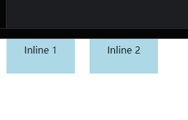

## node --max-old-space-size=4096 是什么意思
`node --max-old-space-size=4096` 是一个 Node.js 命令行选项，用于调整 Node.js 应用程序的内存限制。让我们详细解释这个命令：

1. `node`: 这是启动 Node.js 应用程序的命令。

2. `--max-old-space-size=4096`: 这是一个内存相关的命令行选项。

   - `--max-old-space-size`: 这个选项用于设置 V8 JavaScript 引擎的老生代内存空间的最大值。
   - `4096`: 这个数字表示内存大小，单位是兆字节（MB）。在这个例子中，它设置了 4096MB，也就是 4GB 的内存限制。

### 详细解释

1. **V8 内存结构**:
   Node.js 使用 V8 JavaScript 引擎，它将内存分为年轻代（new space）和老生代（old space）。老生代用于存储长期存活的对象。

2. **默认限制**:
   默认情况下，Node.js 在 64 位系统上的内存限制约为 1.4GB，在 32 位系统上约为 1GB。

3. **增加内存限制的原因**:
   - 处理大量数据
   - 运行内存密集型应用
   - 防止出现 "JavaScript heap out of memory" 错误

4. **使用场景**:
   当你的 Node.js 应用需要处理大量数据或者执行复杂的计算时，可能需要更多的内存。这时，你可以使用这个选项来增加可用内存。

### 示例使用

```bash
node --max-old-space-size=4096 your-script.js
```

这个命令会运行 `your-script.js`，并允许它使用最多 4GB 的内存。

### 注意事项

1. **系统限制**: 确保你的系统有足够的可用内存来支持你设置的限制。

2. **不要过度分配**: 设置过高的内存限制可能会影响系统性能或导致其他问题。

3. **替代方案**: 除了增加内存限制，也可以考虑优化代码、使用流式处理或分批处理来减少内存使用。

4. **环境变量**: 也可以通过设置环境变量来达到同样的效果：
   ```bash
   export NODE_OPTIONS=--max-old-space-size=4096
   node your-script.js
   ```

5. **监控**: 增加内存限制后，建议监控应用的实际内存使用情况，以确保有效利用资源。

通过合理设置内存限制，你可以让 Node.js 应用更好地处理大规模数据和复杂操作，但同时也要注意平衡内存使用和系统资源。

## cookie 有哪些字段
HTTP Cookie 是一种用于在客户端和服务器之间存储和传递信息的小型数据片段。Cookie 的字段（属性）定义了它的行为和作用范围。以下是 HTTP Cookie 的主要字段：

1. **Name**：
   - 描述：Cookie 的名称。
   - 示例：`sessionId`

2. **Value**：
   - 描述：Cookie 的值。
   - 示例：`abc123`

3. **Domain**：
   - 描述：指定 Cookie 可用的域名。默认情况下，Cookie 仅在创建它的域名中可用。
   - 示例：`.example.com`
   - 说明：如果设置为 `.example.com`，则该 Cookie 对 `example.com` 及其所有子域（如 `sub.example.com`）都有效。

4. **Path**：
   - 描述：指定 Cookie 可用的路径。默认情况下，Cookie 仅在创建它的路径及其子路径中可用。
   - 示例：`/account`
   - 说明：如果设置为 `/account`，则该 Cookie 对 `/account` 及其子路径（如 `/account/settings`）都有效。

5. **Expires**：
   - 描述：设置 Cookie 的过期时间，使用绝对时间（UTC 时间）。
   - 示例：`Expires=Wed, 21 Oct 2025 07:28:00 GMT`
   - 说明：如果未设置 `Expires` 或 `Max-Age`，则 Cookie 是会话性（Session）Cookie，浏览器关闭时会自动删除。

6. **Max-Age**：
   - 描述：设置 Cookie 的有效期，使用相对时间（以秒为单位）。
   - 示例：`Max-Age=3600`（1 小时）
   - 说明：`Max-Age` 优先于 `Expires`。

7. **Secure**：
   - 描述：指定 Cookie 仅在通过 HTTPS 连接时发送。
   - 示例：`Secure`
   - 说明：这有助于防止 Cookie 在不安全的 HTTP 连接中被截取。

8. **HttpOnly**：
   - 描述：指定 Cookie 不能通过 JavaScript 的 `Document.cookie` 访问。
   - 示例：`HttpOnly`
   - 说明：这有助于防止跨站脚本（XSS）攻击。

9. **SameSite**：
   - 描述：控制 Cookie 在跨站请求时的行为。
   - 示例：`SameSite=Lax`、`SameSite=Strict`、`SameSite=None`
   - 说明：
     - `Lax`：默认值，Cookie 在跨站请求中不会发送，但在导航到目标站点的链接中会发送。
     - `Strict`：Cookie 在任何跨站请求中都不会发送。
     - `None`：Cookie 在跨站请求中会发送，但必须与 `Secure` 一起使用。

### 示例

以下是一个包含所有主要字段的 Cookie 示例：

```
Set-Cookie: sessionId=abc123; Domain=.example.com; Path=/account; Expires=Wed, 21 Oct 2025 07:28:00 GMT; Max-Age=3600; Secure; HttpOnly; SameSite=Lax
```

### 总结

Cookie 的字段和属性定义了它的作用范围、安全性和生命周期。合理设置这些字段可以确保 Cookie 的安全性和正确性，特别是在处理用户会话和敏感信息时。

## 图片防盗链原理是什么
图片防盗链（Hotlinking Protection）是一种技术，用于防止未经授权的第三方网站直接链接和使用你服务器上的图片或其他资源。其原理主要涉及 HTTP 请求头中的 `Referer` 字段。以下是图片防盗链的基本原理和实现方法：

### 防盗链原理

1. **Referer 字段**：
   - 当浏览器请求一个资源（如图片）时，会在 HTTP 请求头中包含一个 `Referer` 字段，表示该请求是从哪个页面发出的。
   - 例如，当用户在 `example.com` 上的网页中看到一张图片并加载时，浏览器会发送一个请求到图片服务器，并在请求头中包含 `Referer: https://example.com/page.html`。

2. **服务器检查 Referer**：
   - 服务器接收到请求后，可以检查 `Referer` 字段，判断请求是否来自允许的域名。
   - 如果 `Referer` 字段为空或来自不允许的域名，服务器可以拒绝请求或返回替代内容（如错误图片或警告信息）。

### 实现方法

#### 1. 使用 Web 服务器配置

**Apache**：
在 Apache 服务器中，可以使用 `.htaccess` 文件来配置防盗链。

```apache
RewriteEngine On
RewriteCond %{HTTP_REFERER} !^https://(www\.)?yourdomain\.com/ [NC]
RewriteCond %{HTTP_REFERER} !^$
RewriteRule \.(jpg|jpeg|png|gif)$ - [F,NC]
```

**Nginx**：
在 Nginx 服务器中，可以在配置文件中添加相关规则。

```nginx
location ~* \.(jpg|jpeg|png|gif)$ {
    valid_referers none blocked yourdomain.com *.yourdomain.com;
    if ($invalid_referer) {
        return 403;
    }
}
```

#### 2. 使用 CDN（内容分发网络）

许多 CDN 服务提供内置的防盗链功能，可以通过 CDN 提供的控制面板进行配置。例如，Cloudflare 提供了防盗链设置，可以指定允许的域名和拒绝的域名。

### 注意事项

1. **Referer 字段的局限性**：
   - `Referer` 字段可以被客户端修改或隐藏，因此防盗链并不是绝对安全的。
   - 某些隐私保护插件或浏览器设置可能会移除 `Referer` 字段，从而影响正常用户的访问。

2. **用户体验**：
   - 在实施防盗链时，需要确保不会误伤正常用户。例如，可以允许空 `Referer` 或来自搜索引擎的 `Referer`，以避免影响正常访问。

3. **替代方案**：
   - 除了防盗链，可以考虑使用其他方法来保护资源，如通过身份验证、签名 URL（即短期有效的 URL）等方式。

### 示例

以下是一个使用 Apache `.htaccess` 文件的具体示例，允许来自 `yourdomain.com` 和 `anotherdomain.com` 的请求，并拒绝其他所有请求：

```apache
RewriteEngine On
RewriteCond %{HTTP_REFERER} !^https://(www\.)?yourdomain\.com/ [NC]
RewriteCond %{HTTP_REFERER} !^https://(www\.)?anotherdomain\.com/ [NC]
RewriteCond %{HTTP_REFERER} !^$
RewriteRule \.(jpg|jpeg|png|gif)$ https://yourdomain.com/nohotlinking.jpg [R,L]
```

在这个示例中，如果请求不符合条件，服务器将返回一张名为 `nohotlinking.jpg` 的图片，告知用户该图片不允许被盗链。

### 总结

图片防盗链通过检查 HTTP 请求头中的 `Referer` 字段，防止未经授权的第三方网站直接链接和使用你服务器上的资源。通过合理配置 Web 服务器或使用 CDN 服务，可以有效地保护你的资源，减少带宽消耗和潜在的版权问题。

## CSP 是干什么用的
内容安全策略（Content Security Policy，CSP）是一种用于增强网页安全性的防护机制。CSP 通过定义允许加载的资源类型和来源，帮助防止多种类型的攻击，特别是跨站脚本（XSS）和数据注入攻击。以下是 CSP 的主要功能和实现方法：

### CSP 的主要功能

1. **防止跨站脚本（XSS）攻击**：
   - CSP 可以限制哪些脚本可以在网页上执行，从而防止恶意脚本的注入和执行。

2. **防止数据注入攻击**：
   - CSP 可以限制哪些资源（如图片、样式表、脚本等）可以从哪些来源加载，防止攻击者加载恶意资源。

3. **防止点击劫持**：
   - CSP 可以通过设置 `frame-ancestors` 指令，防止网页被嵌入到其他网站的 `<iframe>` 中，从而防止点击劫持攻击。

### CSP 的实现方法

CSP 通过 HTTP 响应头或 HTML `<meta>` 标签来实现。以下是一些常见的 CSP 指令和配置示例：

#### 1. 使用 HTTP 响应头

在服务器配置文件或应用代码中添加 CSP 头。例如，在 Apache 服务器中，可以在 `.htaccess` 文件中添加：

```apache
Header set Content-Security-Policy "default-src 'self'; script-src 'self' https://trusted.cdn.com; object-src 'none';"
```

在 Nginx 服务器中，可以在配置文件中添加：

```nginx
add_header Content-Security-Policy "default-src 'self'; script-src 'self' https://trusted.cdn.com; object-src 'none';";
```

#### 2. 使用 HTML `<meta>` 标签

在 HTML 文件的 `<head>` 部分中添加：

```html
<meta http-equiv="Content-Security-Policy" content="default-src 'self'; script-src 'self' https://trusted.cdn.com; object-src 'none';">
```

### 常见的 CSP 指令

1. **default-src**：
   - 描述：指定默认的资源加载源。
   - 示例：`default-src 'self'`

2. **script-src**：
   - 描述：指定允许加载脚本的源。
   - 示例：`script-src 'self' https://trusted.cdn.com`

3. **style-src**：
   - 描述：指定允许加载样式表的源。
   - 示例：`style-src 'self' https://trusted.cdn.com`

4. **img-src**：
   - 描述：指定允许加载图像的源。
   - 示例：`img-src 'self' https://images.cdn.com`

5. **connect-src**：
   - 描述：指定允许进行连接（如 AJAX 请求、WebSocket）的源。
   - 示例：`connect-src 'self' https://api.example.com`

6. **font-src**：
   - 描述：指定允许加载字体的源。
   - 示例：`font-src 'self' https://fonts.cdn.com`

7. **object-src**：
   - 描述：指定允许加载插件内容（如 Flash、Java Applet）的源。
   - 示例：`object-src 'none'`

8. **frame-ancestors**：
   - 描述：指定允许嵌入此页面的父页面源。
   - 示例：`frame-ancestors 'self' https://trusted.com`

### 示例

以下是一个完整的 CSP 配置示例：

```apache
Header set Content-Security-Policy "default-src 'self'; script-src 'self' https://trusted.cdn.com; style-src 'self' https://trusted.cdn.com; img-src 'self' https://images.cdn.com; connect-src 'self' https://api.example.com; font-src 'self' https://fonts.cdn.com; object-src 'none'; frame-ancestors 'self';"
```

这个配置指定：
- 默认只允许加载来自同一来源（`'self'`）的资源。
- 允许从 `'self'` 和 `https://trusted.cdn.com` 加载脚本和样式。
- 允许从 `'self'` 和 `https://images.cdn.com` 加载图片。
- 允许从 `'self'` 和 `https://api.example.com` 进行连接。
- 允许从 `'self'` 和 `https://fonts.cdn.com` 加载字体。
- 禁止加载任何插件内容。
- 只允许同一来源嵌入此页面。

### 总结

CSP 是一种强大的安全机制，通过限制网页可以加载的资源类型和来源，有效地防止了多种类型的攻击，特别是 XSS 和数据注入攻击。通过合理配置 CSP，可以显著提高网页的安全性。

## 什么是 XSS 攻击，如何避免
XSS（跨站脚本攻击，Cross-Site Scripting）是一种常见的网络安全漏洞，攻击者通过在网页中注入恶意脚本，使得用户在浏览网页时执行这些脚本。这种攻击可能导致用户信息泄露、会话劫持、网页篡改等严重后果。

### XSS 攻击的类型

1. **存储型 XSS**：
   - 恶意脚本被存储在目标服务器上（如数据库中）。
   - 当用户访问包含此脚本的页面时，脚本会被执行。
   - 例如：在论坛帖子中插入恶意脚本。

2. **反射型 XSS**：
   - 恶意脚本包含在 URL 中。
   - 当服务器将这些参数未经处理地反射到页面上时，脚本会被执行。
   - 例如：通过特制的链接诱导用户点击。

3. **DOM 型 XSS**：
   - 攻击发生在客户端，不涉及服务器。
   - 通过修改页面的 DOM 环境来执行恶意脚本。
   - 例如：利用 JavaScript 动态修改页面内容。

### 避免 XSS 攻击的方法

1. **输入验证和过滤**：
   - 对所有用户输入进行严格的验证和过滤。
   - 使用白名单方法，只允许特定的字符或格式。

   ```javascript
   // 示例：过滤用户输入，只允许字母和数字
   function sanitizeInput(input) {
     return input.replace(/[^a-zA-Z0-9]/g, '');
   }
   ```

2. **输出编码**：
   - 在将数据输出到 HTML、JavaScript、CSS 或 URL 时进行适当的编码。
   - 使用专门的编码函数或库。

   ```javascript
   // 示例：HTML 编码
   function escapeHtml(unsafe) {
     return unsafe
          .replace(/&/g, "&amp;")
          .replace(/</g, "&lt;")
          .replace(/>/g, "&gt;")
          .replace(/"/g, "&quot;")
          .replace(/'/g, "&#039;");
   }
   ```

3. **使用安全的 JavaScript API**：
   - 使用 `innerText` 而不是 `innerHTML`。
   - 使用 `textContent` 而不是直接设置 HTML。

   ```javascript
   // 安全示例
   element.textContent = userProvidedContent;
   
   // 不安全示例
   // element.innerHTML = userProvidedContent;
   ```

4. **实施内容安全策略（CSP）**：
   - 使用 CSP 头部限制可执行的脚本来源。

   ```http
   Content-Security-Policy: script-src 'self' https://trusted.cdn.com
   ```

5. **使用 HttpOnly 标志**：
   - 为 cookies 设置 HttpOnly 标志，防止客户端脚本访问这些 cookies。

   ```http
   Set-Cookie: session=123; HttpOnly
   ```

6. **验证 URL 参数**：
   - 特别是对于反射型 XSS，确保 URL 参数在使用前经过适当的验证和编码。

   ```javascript
   // 示例：验证并编码 URL 参数
   const safeParam = encodeURIComponent(userProvidedParam);
   ```

7. **使用现代框架和库**：
   - 许多现代 Web 框架（如 React、Angular、Vue.js）默认提供了一些 XSS 保护机制。
   - 但仍需谨慎使用，特别是在使用允许插入 HTML 的功能时。

8. **定期进行安全审计和渗透测试**：
   - 使用自动化工具和手动测试来检查 XSS 漏洞。
   - 保持对新出现的安全威胁的警惕。

9. **教育开发团队**：
   - 确保所有开发人员了解 XSS 的风险和预防措施。
   - 建立安全编码规范和最佳实践。

10. **使用 X-XSS-Protection 头**：
    - 启用浏览器内置的 XSS 过滤器。

    ```http
    X-XSS-Protection: 1; mode=block
    ```

### 示例：安全处理用户输入并输出

```javascript
// 服务器端代码（Node.js 示例）
const express = require('express');
const app = express();

app.get('/user', (req, res) => {
  const username = req.query.name;
  // 输入验证
  if (!/^[a-zA-Z0-9]+$/.test(username)) {
    return res.status(400).send('Invalid username');
  }
  // 输出编码
  const safeUsername = escapeHtml(username);
  res.send(`Welcome, ${safeUsername}!`);
});

function escapeHtml(unsafe) {
  return unsafe
       .replace(/&/g, "&amp;")
       .replace(/</g, "&lt;")
       .replace(/>/g, "&gt;")
       .replace(/"/g, "&quot;")
       .replace(/'/g, "&#039;");
}

app.listen(3000, () => console.log('Server running on port 3000'));
```

### 结论

防止 XSS 攻击需要多层防御策略。通过结合输入验证、输出编码、安全 API 使用、CSP 实施等方法，可以显著降低 XSS 攻击的风险。重要的是要在整个开发过程中保持安全意识，并定期更新安全实践以应对新的威胁。

## react hooks 的原理是什么
React Hooks 是 React 16.8 引入的一组 API，它们允许在函数组件中使用 state 和其他 React 特性（例如生命周期方法）。Hooks 的引入使得函数组件可以拥有与类组件相同的功能，但代码更加简洁和直观。

### React Hooks 的原理

React Hooks 的核心思想是通过特殊的函数调用来管理组件的状态和副作用。下面是一些关键的原理和机制：

1. **状态管理**：
   - `useState` 是最常用的 Hook，用于在函数组件中添加状态。
   - 每次调用 `useState` 都会返回一个状态值和一个更新该状态的函数。
   - React 使用一个内部的数组来存储每个 Hook 的状态，每次组件渲染时，React 会根据 Hook 调用的顺序来匹配对应的状态。

2. **副作用管理**：
   - `useEffect` 用于在函数组件中执行副作用（如数据获取、订阅、手动 DOM 操作等）。
   - `useEffect` 接受一个回调函数和一个依赖数组，依赖数组中的值发生变化时，回调函数会重新执行。
   - React 通过一个队列来管理和执行这些副作用。

3. **Hook 调用顺序**：
   - Hooks 必须在函数组件的顶层调用，不能在条件语句或循环中调用。这是因为 React 依赖于 Hook 调用的顺序来正确地管理状态和副作用。
   - 每次组件渲染时，Hooks 的调用顺序必须保持一致，以确保 React 能够正确地更新和管理状态。

4. **自定义 Hooks**：
   - 开发者可以创建自定义 Hooks，将逻辑封装在一个可重用的函数中。
   - 自定义 Hooks 是通过调用其他 Hooks 来实现的，它们的命名约定是以 `use` 开头。

### 代码示例

以下是一个简单的示例，展示了如何使用 `useState` 和 `useEffect` Hooks：

```javascript
import React, { useState, useEffect } from 'react';

function Counter() {
  // 使用 useState Hook 添加状态
  const [count, setCount] = useState(0);

  // 使用 useEffect Hook 执行副作用
  useEffect(() => {
    document.title = `You clicked ${count} times`;

    // 清理副作用
    return () => {
      document.title = 'React App';
    };
  }, [count]); // 依赖数组

  return (
    <div>
      <p>You clicked {count} times</p>
      <button onClick={() => setCount(count + 1)}>
        Click me
      </button>
    </div>
  );
}

export default Counter;
```

### 工作原理

1. **初始化和渲染**：
   - 当组件首次渲染时，React 会初始化一个内部的状态数组和一个索引（`hookIndex`）。
   - 每次调用 `useState` 时，React 会根据当前的 `hookIndex` 从状态数组中获取对应的状态值，并将 `hookIndex` 增加 1。
   - `useEffect` 也是类似的机制，React 会将副作用回调函数存储在一个队列中，并在组件渲染后执行这些回调。

2. **状态更新**：
   - 当状态更新函数（如 `setCount`）被调用时，React 会将新的状态值存储在状态数组中，并触发组件重新渲染。
   - 组件重新渲染时，React 会重新执行函数组件，并根据 Hook 调用的顺序匹配和更新状态。

3. **依赖数组**：
   - `useEffect` 的依赖数组用于控制副作用的执行频率。如果依赖数组中的值发生变化，React 会重新执行副作用回调。
   - 如果依赖数组为空，副作用只会在组件挂载和卸载时执行一次。

### 内部机制

React Hooks 的实现依赖于以下几个内部机制：

1. **Hook 链表**：
   - React 维护一个 Hook 链表，每个 Hook 都是链表中的一个节点。
   - 每次组件渲染时，React 会遍历这个链表，并根据 Hook 调用的顺序更新状态和副作用。

2. **Fiber 数据结构**：
   - React 使用 Fiber 数据结构来管理组件树的更新和渲染。
   - 每个组件对应一个 Fiber 节点，Fiber 节点中包含了组件的状态

## 为什么不能在表达式里面定义 react hooks
在 React 中，Hooks 是用来在函数组件中引入状态和副作用管理的工具。然而，React 有一个明确的规则：**Hooks 只能在函数组件的顶层调用，不能在表达式或条件语句中调用**。这是为了确保每次组件渲染时，Hooks 的调用顺序是稳定和一致的。以下是详细的解释和原因：

### Hooks 调用规则

1. **只能在顶层调用**：
   - Hooks 必须在函数组件或自定义 Hook 的顶层调用，不能在循环、条件语句或嵌套函数中调用。

2. **只能在 React 函数组件或自定义 Hooks 中调用**：
   - 不能在普通的 JavaScript 函数中调用 Hooks。

### 原因和原理

React 使用一个内部的机制来跟踪和管理 Hooks 的状态。这个机制依赖于 Hook 调用的顺序。如果在表达式或条件语句中调用 Hooks，会破坏这种顺序，导致 React 无法正确地管理状态和副作用。

#### 详细解释

1. **Hooks 的内部机制**：
   - React 通过一个内部的数组来存储每个 Hook 的状态。
   - 每次组件渲染时，React 会按照 Hook 调用的顺序依次读取和更新这些状态。

2. **调用顺序的重要性**：
   - 假设在某次渲染中，`useState` 和 `useEffect` 的调用顺序是：`useState -> useEffect`。
   - 如果在下一次渲染中，调用顺序变成了：`useEffect -> useState`，React 会读取和更新错误的状态，导致意外的行为。

3. **条件语句中的问题**：
   - 如果在条件语句中调用 Hooks，如下例所示：
     ```javascript
     if (someCondition) {
       const [state, setState] = useState(initialValue);
     }
     ```
   - 在这种情况下，当 `someCondition` 的值发生变化时，`useState` 的调用会出现或消失，导致 Hooks 调用顺序的不一致。

### 代码示例

#### 错误示例

```javascript
function MyComponent(props) {
  if (props.show) {
    const [count, setCount] = useState(0); // 错误：在条件语句中调用 Hook
  }

  // 其他代码
}
```

#### 正确示例

```javascript
function MyComponent(props) {
  const [count, setCount] = useState(0); // 在顶层调用 Hook

  if (props.show) {
    // 根据条件渲染部分 UI
    return <div>{count}</div>;
  }

  // 其他代码
}
```

### React 为什么需要这个规则

1. **一致性和可靠性**：
   - 确保每次渲染时，Hooks 的调用顺序和数量是固定的，从而确保状态管理的一致性和可靠性。

2. **性能优化**：
   - React 可以在开发环境中通过检查 Hooks 的调用顺序来帮助开发者发现潜在的错误，从而提高调试效率。

### 总结

为了确保 React 能够正确地管理和更新组件的状态，Hooks 必须在函数组件的顶层调用，而不能在表达式、条件语句或循环中调用。遵循这个规则，可以避免很多潜在的错误和复杂的调试工作。

## display: inline 的元素设置 margin 和 padding 会生效吗
在 HTML 和 CSS 中，`display: inline` 的元素设置 `margin` 和 `padding` 会部分生效。具体来说：

### `margin` 的效果

- **横向方向**（左右）：
  - `inline` 元素的 `margin-left` 和 `margin-right` 是有效的，会影响到元素之间的水平间距。
- **纵向方向**（上下）：
  - `margin-top` 和 `margin-bottom` 对于 `inline` 元素通常不起作用，因为 `inline` 元素不会影响到块级布局的上下间距。即使设置了，也不会影响元素之间的垂直距离。

### `padding` 的效果

- **横向方向**（左右）：
  - `inline` 元素的 `padding-left` 和 `padding-right` 是有效的，会影响到内容的水平内边距。
- **纵向方向**（上下）：
  - `padding-top` 和 `padding-bottom` 对于 `inline` 元素同样是有效的，会增加元素内容的垂直内边距，并且可能会影响到元素的高度，但不会增加元素之间的垂直间距。

### 示例

```html
<!DOCTYPE html>
<html lang="en">
<head>
  <meta charset="UTF-8">
  <meta name="viewport" content="width=device-width, initial-scale=1.0">
  <title>Inline Elements Margin and Padding</title>
  <style>
    .inline-element {
      display: inline;
      margin: 10px;
      padding: 10px;
      background-color: lightblue;
    }
  </style>
</head>
<body>
  <span class="inline-element">Inline 1</span>
  <span class="inline-element">Inline 2</span>
</body>
</html>
```

在上面的例子中：

- `margin-left` 和 `margin-right` 会影响到两个 `span` 元素之间的水平距离。
- `padding-left` 和 `padding-right` 会影响到 `span` 内部内容与边界之间的水平内边距。
- `padding-top` 和 `padding-bottom` 会影响到 `span` 内部内容与边界之间的垂直内边距，并且可能会影响 `span` 元素的高度。
- `margin-top` 和 `margin-bottom` 不会影响 `span` 元素之间的垂直距离。

### 结论

对于 `inline` 元素，横向的 `margin` 和 `padding` 是有效的，而纵向的 `padding` 也是有效的。纵向的 `margin` 虽然可以设置，但不会影响布局。要使纵向 `margin` 生效，可以将元素设置为 `inline-block` 或 `block`。


## 响应式布局需要注意哪一些
响应式布局是一种网页设计方法，旨在使网站能够在不同设备和屏幕尺寸上提供良好的用户体验。在实现响应式布局时，需要注意以下几个关键方面：

1. 流式布局（Fluid Grid）
   - 使用相对单位（如百分比、em、rem）而不是固定像素值。
   - 例如：`width: 100%;` 或 `width: 50%;`

2. 弹性图片（Flexible Images）
   - 确保图片能够自适应容器大小。
   - CSS 示例：`img { max-width: 100%; height: auto; }`

3. 媒体查询（Media Queries）
   - 使用 CSS 媒体查询来为不同屏幕尺寸定制样式。
   - 示例：
     ```css
     @media screen and (max-width: 768px) {
       /* 针对小屏幕的样式 */
     }
     ```

4. 视口设置（Viewport）
   - 在 HTML 头部添加视口元标签。
   - `<meta name="viewport" content="width=device-width, initial-scale=1">`

5. 断点选择（Breakpoints）
   - 选择合适的断点来调整布局。
   - 常见断点：320px（移动设备）、768px（平板）、1024px（桌面）等。

6. 移动优先（Mobile First）
   - 先设计移动端布局，然后逐步扩展到大屏幕。
   - 使用 `min-width` 而不是 `max-width` 的媒体查询。

7. 灵活的布局系统
   - 使用 CSS Flexbox 或 Grid 来创建灵活的布局。
   - Flexbox 示例：
     ```css
     .container {
       display: flex;
       flex-wrap: wrap;
     }
     ```

8. 内容优先级
   - 确定内容的重要性，在小屏幕上优先显示重要内容。
   - 可以使用 CSS 的 `order` 属性调整 Flexbox 项目的顺序。

9. 触摸友好
   - 为移动设备优化交互元素，如增大按钮尺寸和点击区域。
   - 推荐最小触摸目标尺寸为 44x44 像素。

10. 性能优化
    - 优化图片和资源加载，考虑使用响应式图片技术。
    - 使用 `<picture>` 元素或 `srcset` 属性提供不同分辨率的图片。

11. 字体响应
    - 使用响应式的字体大小，可以使用 `vw` 单位或 CSS `clamp()` 函数。
    - 示例：`font-size: clamp(16px, 4vw, 22px);`

12. 导航设计
    - 为移动设备设计适合的导航模式，如汉堡菜单。
    - 在大屏幕上展开导航，小屏幕上折叠。

13. 表格处理
    - 对复杂表格进行响应式处理，可以考虑在小屏幕上改变表格布局。
    - 可以使用 CSS 的 `display: block;` 来改变表格的显示方式。

14. 测试
    - 在多种设备和浏览器上进行测试。
    - 使用浏览器开发工具的设备模拟功能。

15. 避免固定宽度
    - 尽量避免使用固定宽度，特别是对于容器元素。

16. 考虑方向变化
    - 设计时考虑设备的横向和纵向模式。
    - 使用 `orientation` 媒体查询：
      ```css
      @media (orientation: landscape) {
        /* 横向模式样式 */
      }
      ```

17. 渐进增强
    - 从基本功能开始，逐步添加高级特性。
    - 确保核心内容和功能在所有设备上可用。

实现示例：

```html
<!DOCTYPE html>
<html lang="en">
<head>
    <meta charset="UTF-8">
    <meta name="viewport" content="width=device-width, initial-scale=1.0">
    <title>响应式布局示例</title>
    <style>
        body {
            font-family: Arial, sans-serif;
            margin: 0;
            padding: 0;
        }
        .container {
            max-width: 1200px;
            margin: 0 auto;
            padding: 20px;
        }
        .flex-container {
            display: flex;
            flex-wrap: wrap;
        }
        .flex-item {
            flex: 1 1 300px;
            margin: 10px;
            padding: 20px;
            background-color: #f0f0f0;
        }
        img {
            max-width: 100%;
            height: auto;
        }
        @media screen and (max-width: 768px) {
            .flex-item {
                flex-basis: 100%;
            }
        }
    </style>
</head>
<body>
    <div class="container">
        <h1>响应式布局示例</h1>
        <div class="flex-container">
            <div class="flex-item">
                <h2>项目 1</h2>
                <p>这是一个响应式布局的示例项目。</p>
                
            </div>
            <div class="flex-item">
                <h2>项目 2</h2>
                <p>这个布局会根据屏幕大小自动调整。</p>
                
            </div>
            <div class="flex-item">
                <h2>项目 3</h2>
                <p>在小屏幕上，这些项目会垂直堆叠。</p>
                
            </div>
        </div>
    </div>
</body>
</html>
```

这个示例展示了一个简单的响应式布局，使用了 Flexbox 进行布局，媒体查询来调整小屏幕上的样式，以及响应式图片。通过调整浏览器窗口大小，你可以看到布局如何适应不同的屏幕宽度。

## font-size: clamp(16px, 4vw, 22px); 是怎么用的
`font-size: clamp(16px, 4vw, 22px);` 是一个使用 CSS `clamp()` 函数的字体大小设置方法。这个函数允许你为属性值设置一个范围，非常适合用于响应式设计。让我详细解释一下这个语句的含义和用法：

### `clamp()` 函数的基本语法

`clamp(MIN, VAL, MAX)`

- `MIN`: 最小值
- `VAL`: 首选值
- `MAX`: 最大值

### 解析 `font-size: clamp(16px, 4vw, 22px);`

1. **最小值 (MIN)**: 16px
   - 字体大小永远不会小于 16px。

2. **首选值 (VAL)**: 4vw
   - `vw` 是视口宽度的单位，1vw 等于视口宽度的 1%。
   - 4vw 意味着字体大小会是视口宽度的 4%。

3. **最大值 (MAX)**: 22px
   - 字体大小永远不会大于 22px。

### 工作原理

- 当 4vw 小于 16px 时，字体大小将是 16px。
- 当 4vw 在 16px 和 22px 之间时，字体大小将等于 4vw。
- 当 4vw 大于 22px 时，字体大小将是 22px。

### 实际效果

- 在小屏幕上（如窄手机屏幕），字体大小可能会保持在 16px。
- 随着屏幕变宽，字体大小会逐渐增加，但始终保持在视口宽度的 4%。
- 在大屏幕上，字体大小会达到上限 22px 并停止增长。

### 使用示例

```html
<!DOCTYPE html>
<html lang="en">
<head>
    <meta charset="UTF-8">
    <meta name="viewport" content="width=device-width, initial-scale=1.0">
    <title>Clamp Font Size Demo</title>
    <style>
        body {
            font-family: Arial, sans-serif;
        }
        .responsive-text {
            font-size: clamp(16px, 4vw, 22px);
        }
    </style>
</head>
<body>
    <p class="responsive-text">
        这段文字使用了响应式字体大小。
        尝试调整浏览器窗口大小来查看效果。
    </p>
</body>
</html>
```

### 优点

1. **自适应**: 字体大小会根据视口宽度自动调整。
2. **可控**: 设置了最小和最大限制，避免字体过小或过大。
3. **平滑过渡**: 在最小值和最大值之间，字体大小变化是连续的。

### 注意事项

- 浏览器支持: `clamp()` 函数在现代浏览器中得到广泛支持，但在一些旧版浏览器中可能不可用。
- 可访问性: 确保最小字体大小足够大，以保证可读性。
- 测试: 在不同设备和屏幕尺寸上测试，确保字体大小在各种情况下都合适。

使用 `clamp()` 函数可以创建更加灵活和响应式的布局，特别适合于需要在不同设备上保持良好可读性的文本元素。

## http 请求头中的 X-Forwarded-For 代表什么意思
`X-Forwarded-For` 是一个 HTTP 头字段，用于识别通过 HTTP 代理或负载均衡器连接到 Web 服务器的客户端的原始 IP 地址。这个头字段通常由代理服务器或负载均衡器添加。

### 详细解释

1. **客户端 IP 地址**:
   - 当客户端直接连接到服务器时，服务器可以通过请求的来源 IP 地址直接获取客户端的 IP 地址。
   
2. **代理服务器或负载均衡器**:
   - 当客户端通过代理服务器或负载均衡器连接到 Web 服务器时，服务器接收到的请求来源 IP 地址是代理服务器或负载均衡器的 IP 地址，而不是客户端的原始 IP 地址。

3. **X-Forwarded-For 头字段**:
   - 为了解决这个问题，代理服务器或负载均衡器会添加 `X-Forwarded-For` 头字段，里面包含客户端的原始 IP 地址。
   - 格式：`X-Forwarded-For: client1, proxy1, proxy2`
     - `client1` 是客户端的原始 IP 地址。
     - `proxy1` 是第一个代理服务器的 IP 地址。
     - `proxy2` 是第二个代理服务器的 IP 地址。
     - 依此类推，多个代理服务器的 IP 地址用逗号分隔，最左边是最原始的客户端 IP 地址。

### 示例

假设一个客户端的 IP 地址是 `203.0.113.1`，它通过两个代理服务器（`192.0.2.1` 和 `198.51.100.1`）访问一个 Web 服务器。在这种情况下，Web 服务器接收到的 `X-Forwarded-For` 头字段可能是：

```
X-Forwarded-For: 203.0.113.1, 192.0.2.1, 198.51.100.1
```

### 使用场景

1. **日志记录**:
   - 服务器可以使用 `X-Forwarded-For` 头字段来记录客户端的原始 IP 地址，以便进行访问日志记录和分析。

2. **IP 限制**:
   - 基于客户端的原始 IP 地址进行访问控制和限制。

3. **地理位置**:
   - 用于根据客户端的原始 IP 地址进行地理位置的检测和服务定制。

### 安全注意事项

- **信任问题**:
  - `X-Forwarded-For` 头字段是可以被客户端伪造的。因此，服务器应当只信任来自可信代理服务器或负载均衡器的 `X-Forwarded-For` 头字段。
  
- **防止 IP 欺骗**:
  - 服务器应当验证 `X-Forwarded-For` 头字段的来源，确保其是由可信的代理服务器或负载均衡器添加的，而不是由恶意客户端伪造的。

### 示例代码

以下是一个简单的示例，展示如何在服务器端（例如 Node.js）解析 `X-Forwarded-For` 头字段，获取客户端的原始 IP 地址：

```javascript
const http = require('http');

const requestListener = (req, res) => {
    let clientIp = req.headers['x-forwarded-for'] || req.connection.remoteAddress;
    // 如果有多个 IP 地址，取第一个
    if (clientIp.includes(',')) {
        clientIp = clientIp.split(',')[0];
    }
    res.writeHead(200, {'Content-Type': 'text/plain'});
    res.end(`Client IP: ${clientIp}\n`);
};

const server = http.createServer(requestListener);
server.listen(8080, () => {
    console.log('Server is running on http://localhost:8080');
});
```

在这个示例中，服务器会检查请求头中的 `X-Forwarded-For` 字段，如果存在则使用其值，否则使用连接的远程地址。并且，如果 `X-Forwarded-For` 包含多个 IP 地址，则取第一个（最左边的）作为客户端的原始 IP 地址。

## prefetch 与 preload 的区别是什么
`prefetch` 和 `preload` 都是用于优化网页加载性能的资源提示（Resource Hints），但它们有不同的用途和行为。让我们详细比较这两者：

### Preload

1. **目的**：
   - 用于当前页面立即需要的资源。
   - 告诉浏览器尽快下载并缓存资源，因为它们很快就会被使用。

2. **优先级**：
   - 高优先级，浏览器会立即开始加载。

3. **使用时机**：
   - 当你确定资源在当前页面一定会被使用时。

4. **浏览器行为**：
   - 浏览器会立即开始下载资源，不管它是否立即需要。

5. **语法示例**：
   ```html
   <link rel="preload" href="style.css" as="style">
   <link rel="preload" href="main.js" as="script">
   ```

6. **适用场景**：
   - 关键 CSS 文件
   - 重要的 JavaScript 文件
   - 自定义字体文件

### Prefetch

1. **目的**：
   - 用于可能在将来的页面中需要的资源。
   - 告诉浏览器在空闲时间下载资源，以备将来使用。

2. **优先级**：
   - 低优先级，浏览器会在空闲时才开始加载。

3. **使用时机**：
   - 当你预测用户可能会访问的下一个页面或将来可能需要的资源时。

4. **浏览器行为**：
   - 浏览器会在空闲时下载资源，不会影响当前页面的加载。

5. **语法示例**：
   ```html
   <link rel="prefetch" href="page2.html">
   <link rel="prefetch" href="secondary-style.css">
   ```

6. **适用场景**：
   - 下一页的 HTML 文件
   - 可能会用到的大型资源文件
   - 用户可能会访问的其他页面的资源

### 主要区别

1. **加载时机**：
   - Preload：立即加载
   - Prefetch：在浏览器空闲时加载

2. **优先级**：
   - Preload：高优先级
   - Prefetch：低优先级

3. **使用目的**：
   - Preload：当前页面必需的资源
   - Prefetch：未来可能需要的资源

4. **资源缓存**：
   - Preload：资源被缓存并立即可用
   - Prefetch：资源被缓存，但可能在将来的导航中才被使用

5. **对当前页面加载的影响**：
   - Preload：可能会影响当前页面的加载性能（如果使用不当）
   - Prefetch：不会影响当前页面的加载性能

### 使用建议

1. **合理使用**：
   - 不要过度使用 preload，因为它会消耗带宽和影响其他资源的加载。
   - prefetch 可以更自由地使用，因为它不会影响当前页面的性能。

2. **结合使用**：
   - 对于当前页面关键资源使用 preload。
   - 对于可能在未来页面中使用的资源使用 prefetch。

3. **监控性能**：
   - 使用浏览器开发者工具和性能分析工具来监控这些提示的效果。

4. **考虑用户行为**：
   - 基于用户行为分析来决定哪些资源应该被 prefetch。

5. **动态使用**：
   - 可以通过 JavaScript 动态添加 preload 和 prefetch 链接，以适应不同的场景。

通过合理使用 preload 和 prefetch，你可以显著提高网站的加载性能和用户体验。preload 确保关键资源快速加载，而 prefetch 则为未来的交互做好准备，两者结合使用可以创造出流畅的用户体验。

## peerDependency 是为了解决什么问题
`peerDependencies` 是 npm 包管理系统中的一个重要概念，它主要用于解决以下问题：

1. 版本冲突
2. 重复安装
3. 插件系统
4. 灵活性和兼容性

让我们详细探讨这些方面：

### 1. 版本冲突

**问题**：
当多个包依赖同一个库的不同版本时，可能会导致版本冲突。

**解决**：
通过 `peerDependencies`，包可以声明它与宿主包（通常是应用程序）使用的依赖版本的兼容性，而不是将这些依赖打包在自己的 `node_modules` 中。

**示例**：
假设你正在开发一个 React 组件库，你希望它能够与 React 16.x 和 17.x 版本兼容。你可以在 `package.json` 中这样声明：

```json
{
  "peerDependencies": {
    "react": "^16.0.0 || ^17.0.0"
  }
}
```

### 2. 重复安装

**问题**：
如果每个包都包含其所有依赖，可能会导致同一库的多个版本被安装，增加项目大小。

**解决**：
使用 `peerDependencies` 可以避免重复安装相同库的多个版本，因为它依赖于宿主包提供的版本。

### 3. 插件系统

**问题**：
在开发插件系统时，插件需要与主程序使用相同版本的核心库。

**解决**：
`peerDependencies` 允许插件声明它们与主程序使用的核心库版本的兼容性，而不需要自己打包这些库。

**示例**：
假设你正在为一个构建工具开发插件：

```json
{
  "name": "my-build-tool-plugin",
  "peerDependencies": {
    "my-build-tool": "^2.0.0"
  }
}
```

### 4. 灵活性和兼容性

**问题**：
包开发者需要确保他们的包能够与宿主应用程序使用的依赖版本兼容。

**解决**：
通过 `peerDependencies`，包可以声明一个更宽松的版本范围，增加与不同项目的兼容性。

### 使用注意事项

1. **版本范围**：在声明 `peerDependencies` 时，通常使用较宽松的版本范围，以增加兼容性。

2. **安装提醒**：在 npm 3-6 版本中，如果 `peerDependencies` 未满足，npm 只会给出警告。从 npm 7 开始，默认会自动安装 `peerDependencies`。

3. **测试**：包开发者应该测试他们的包在不同版本的 peer dependencies 下的行为。

4. **文档**：清晰地记录你的包所需的 peer dependencies，以及支持的版本范围。

### 示例场景

假设你正在开发一个名为 `my-react-library` 的 React 组件库：

```json
{
  "name": "my-react-library",
  "version": "1.0.0",
  "peerDependencies": {
    "react": "^16.8.0 || ^17.0.0",
    "react-dom": "^16.8.0 || ^17.0.0"
  }
}
```

这样，你的库可以与 React 16.8 或更高版本（包括 React 17）一起使用，而不需要自己打包 React。使用你的库的项目需要自己提供兼容版本的 React。

总之，`peerDependencies` 是一个强大的工具，用于管理包之间的关系，特别是在开发库、插件或需要与宿主应用共享依赖的情况下。它有助于减少版本冲突，避免重复安装，并提高包的灵活性和兼容性。

## semver 指什么
Semver 是 "Semantic Versioning"（语义化版本控制）的缩写，它是一种广泛使用的软件版本号命名规范。这个规范由 Tom Preston-Werner（GitHub 的联合创始人）提出，旨在解决"依赖地狱"问题并提供一个清晰、统一的版本号系统。

### Semver 的基本结构

Semver 使用三个数字来表示版本号，格式为：

```
MAJOR.MINOR.PATCH
```

例如：`2.4.1`

### 各个部分的含义

1. **MAJOR**（主版本号）：
   - 当你做了不兼容的 API 修改时递增
   - 例如：从 1.x.x 升级到 2.0.0

2. **MINOR**（次版本号）：
   - 当你添加了向下兼容的新功能时递增
   - 例如：从 1.1.x 升级到 1.2.0

3. **PATCH**（修订号）：
   - 当你做了向下兼容的问题修正时递增
   - 例如：从 1.1.1 升级到 1.1.2

### 特殊版本号

除了主要的三位数字，Semver 还允许在 PATCH 版本号后面添加标签：

- **预发布版本**：添加一个连字符和标识符，如 `1.0.0-alpha`, `1.0.0-beta.1`
- **构建元数据**：添加一个加号和标识符，如 `1.0.0+20130313144700`

### 版本范围

在依赖管理中，常常需要指定版本范围。Semver 提供了多种方式来表示版本范围：

- **精确版本**：`1.2.3`
- **大于等于**：`>=1.2.3`
- **小于**：`<1.2.3`
- **波浪号（Tilde）**：`~1.2.3`（允许 PATCH 级别的更新）
- **插入符（Caret）**：`^1.2.3`（允许 MINOR 和 PATCH 级别的更新）
- **范围**：`1.2.3 - 2.3.4`
- **或**：`1.2.3 || >=2.5.0 <3.0.0`

### 示例

1. `^1.2.3` 表示兼容 1.2.3 及更高版本，但小于 2.0.0
2. `~1.2.3` 表示兼容 1.2.3 及更高的修订版本，但小于 1.3.0
3. `>=1.2.3 <2.0.0` 表示大于等于 1.2.3 但小于 2.0.0 的任何版本

### Semver 的优势

1. **清晰性**：版本号的含义明确，便于理解版本变化的性质。
2. **兼容性管理**：帮助开发者和用户理解不同版本之间的兼容性。
3. **自动化**：便于自动化工具进行版本管理和依赖解析。
4. **沟通标准**：为开发者和用户提供了一个共同的语言来讨论软件版本。

### 在 package.json 中的应用

在 Node.js 项目的 `package.json` 文件中，通常使用 Semver 来指定依赖的版本范围：

```json
{
  "dependencies": {
    "express": "^4.17.1",
    "lodash": "~4.17.20",
    "react": ">=16.8.0 <18.0.0"
  }
}
```

### 注意事项

1. **遵循规范**：在发布新版本时，严格遵循 Semver 规范。
2. **文档化**：清晰地记录每个版本的变更。
3. **谨慎处理主版本更新**：主版本号的增加意味着不兼容的变化，应谨慎处理。
4. **使用工具**：利用自动化工具来管理版本号，减少人为错误。

总之，Semver 是一个强大的版本控制规范，它不仅提供了版本号的命名标准，还为软件开发中的依赖管理提供了清晰的指导。正确使用 Semver 可以大大改善软件的维护性和可用性。

## optionalDependencies 的使用场景是什么
`optionalDependencies` 是 npm 包管理系统中的一个特性，用于声明那些在安装失败时不会阻止项目安装的依赖。这些依赖是可选的，项目在缺少它们的情况下仍然可以运行。

### 使用场景

1. **非关键性功能**：
   - 当某个依赖只用于增强功能，而不是核心功能时，可以将其放入 `optionalDependencies`。这样，即使该依赖安装失败，核心功能仍然能正常工作。

2. **平台相关依赖**：
   - 一些依赖只在特定平台上有用。例如，一个跨平台的项目可能有某些依赖只在特定操作系统上需要。将这些依赖放入 `optionalDependencies` 中，可以确保在其他平台上安装时不会因为这些依赖的不可用而导致安装失败。

3. **兼容性问题**：
   - 某些依赖可能在不同的环境中有兼容性问题。通过将这些依赖列为 `optionalDependencies`，可以在出现问题时继续安装其他依赖，并在应用中处理缺少这些依赖的情况。

4. **渐进增强**：
   - 如果某些功能是对基础功能的增强或改进，可以使用 `optionalDependencies`。这样，基础功能可以在缺少增强功能的情况下仍然正常工作。

### 示例

假设你正在开发一个支持多种数据库的应用程序，而 MongoDB 是一个可选的数据库引擎。你可以将 `mongodb` 模块作为 `optionalDependencies`：

```json
{
  "name": "my-application",
  "version": "1.0.0",
  "dependencies": {
    "express": "^4.17.1"
  },
  "optionalDependencies": {
    "mongodb": "^3.6.0"
  }
}
```

在这种情况下，如果 `mongodb` 安装失败，npm 不会因为这个错误而中止安装整个项目。你可以在代码中检查 `mongodb` 模块是否可用：

```javascript
let mongodb;
try {
  mongodb = require('mongodb');
  console.log('MongoDB module loaded successfully');
} catch (e) {
  console.log('MongoDB module not available');
}

// Your application logic that conditionally uses MongoDB
if (mongodb) {
  // Use MongoDB features
} else {
  // Fallback to other database or handle absence
}
```

### 注意事项

1. **处理安装失败**：
   - 当使用 `optionalDependencies` 时，应该在代码中处理这些依赖可能不可用的情况，以确保应用不会因为缺少这些依赖而崩溃。

2. **依赖冲突**：
   - 虽然 `optionalDependencies` 不会阻止安装，但要小心避免这些依赖和其他依赖之间的版本冲突。

3. **文档化**：
   - 明确记录哪些依赖是可选的，以及在缺少这些依赖时，应用的哪些功能会受到影响。

4. **用户通知**：
   - 如果某些功能需要可选依赖才能工作，最好在应用中提供清晰的通知或警告，告诉用户缺少某些功能的原因。

总之，`optionalDependencies` 提供了一种灵活的方式来管理非关键性依赖，使得项目在多种环境下都能顺利安装和运行。正确使用这一特性可以提升应用的健壮性和兼容性。

## package-lock.json 与 yarn.lock 有什么区别
package-lock.json 和 yarn.lock 都是用于锁定依赖版本的文件，但它们分别由 npm 和 Yarn 这两个不同的包管理器使用。虽然它们的目的相似，但在实现和特性上有一些区别：

1. 创建和使用方式

package-lock.json:
- 由 npm 5.0 及以上版本自动生成
- 当运行 npm install 时自动创建或更新
- 与 package.json 一起使用

yarn.lock:
- 由 Yarn 包管理器创建和维护
- 当运行 yarn install 时自动创建或更新
- 与 package.json 一起使用

2. 文件格式

package-lock.json:
- 使用 JSON 格式
- 结构较为复杂，包含更多元数据

yarn.lock:
- 使用自定义的纯文本格式
- 结构相对简单，更易于人类阅读

3. 版本控制策略

package-lock.json:
- 默认使用 "^" 符号来指定版本范围
- 允许安装补丁和次要版本更新

yarn.lock:
- 默认精确锁定版本号
- 更严格地控制版本，通常只允许完全相同的版本

4. 依赖解析算法

npm (package-lock.json):
- 使用递归的依赖解析算法
- 可能导致较深的依赖树

Yarn (yarn.lock):
- 使用确定性的扁平化依赖解析算法
- 通常产生更扁平的依赖结构

5. 安全性考虑

package-lock.json:
- 从 npm 5.7.0 开始加入了完整性校验
- 使用 SHA-512 哈希来验证包的完整性

yarn.lock:
- 从一开始就包含了完整性校验
- 使用更安全的校验机制

6. 性能

npm (package-lock.json):
- 在较新版本中性能有所提升
- 但通常比 Yarn 稍慢

Yarn (yarn.lock):
- 通常比 npm 更快，特别是在大型项目中
- 并行下载和缓存机制更高效

7. 跨平台一致性

package-lock.json:
- 在不同操作系统间可能产生差异
- 可能需要额外配置来确保跨平台一致性

yarn.lock:
- 设计时就考虑了跨平台一致性
- 通常在不同操作系统间表现更一致

8. 生态系统和工具支持

package-lock.json:
- 作为 npm 的标准，得到广泛支持
- 许多工具和 CI 系统默认支持

yarn.lock:
- 虽然支持广泛，但可能需要额外配置
- 一些特定的 Yarn 功能可能不被所有工具支持

9. 更新和维护

package-lock.json:
- npm 持续更新和改进
- 作为 Node.js 默认包管理器的一部分，维护频繁

yarn.lock:
- Yarn 团队持续更新和改进
- 作为独立项目，更新可能不如 npm 频繁

10. 兼容性

package-lock.json:
- 可以与 Yarn 项目一起使用，但可能需要额外步骤
- npm 可以读取 yarn.lock，但优先使用 package-lock.json

yarn.lock:
- Yarn 可以读取 package-lock.json，但优先使用 yarn.lock
- 在纯 npm 项目中可能需要额外配置

总结：
虽然 package-lock.json 和 yarn.lock 都旨在解决依赖版本锁定的问题，但它们在实现细节、性能特性和生态系统支持上有所不同。选择使用哪一个通常取决于项目需求、团队偏好以及现有的工具链和流程。在某些情况下，项目可能会同时包含这两个文件以支持不同的开发环境。

## fetch 中 credentials 指什么意思，可以取什么值
在使用 `fetch` API 时，`credentials` 选项用于控制请求中是否包含凭据（如 cookies、HTTP 认证信息等）。它可以取以下三个值：

1. **`omit`**：
   - 默认值。
   - 请求中不包含任何凭据。即使请求的 URL 与当前页面的源相同，也不会发送 cookies 或者 HTTP 认证头。

2. **`same-origin`**：
   - 仅在请求的 URL 与当前页面的源相同时才发送凭据。
   - 对于跨域请求，不会发送 cookies 或者 HTTP 认证头。

3. **`include`**：
   - 无论请求的 URL 与当前页面的源是否相同，都会发送凭据。
   - 对于跨域请求，也会发送 cookies 或者 HTTP 认证头。

### 示例

假设你要向一个 API 发送请求，并且需要在请求中包含 cookies 或者其他凭据：

```javascript
// 不包含任何凭据
fetch('https://example.com/api/data', {
  method: 'GET',
  credentials: 'omit'
})
.then(response => response.json())
.then(data => console.log(data))
.catch(error => console.error('Error:', error));

// 仅在同源请求中包含凭据
fetch('https://example.com/api/data', {
  method: 'GET',
  credentials: 'same-origin'
})
.then(response => response.json())
.then(data => console.log(data))
.catch(error => console.error('Error:', error));

// 无论同源或跨域请求都包含凭据
fetch('https://example.com/api/data', {
  method: 'GET',
  credentials: 'include'
})
.then(response => response.json())
.then(data => console.log(data))
.catch(error => console.error('Error:', error));
```

### 注意事项

1. **跨域请求和 CORS**：
   - 当使用 `credentials: 'include'` 发送跨域请求时，服务器必须设置适当的 CORS 头（如 `Access-Control-Allow-Origin` 和 `Access-Control-Allow-Credentials`），否则请求会被浏览器拒绝。

2. **安全性**：
   - 小心处理包含凭据的请求，确保不会将敏感信息泄露给不受信任的源。
   - 确保服务器正确配置了 CORS 头，以防止跨站请求伪造（CSRF）攻击。

3. **默认值**：
   - 在不指定 `credentials` 选项的情况下，默认值为 `omit`，即请求中不包含任何凭据。

通过正确使用 `credentials` 选项，你可以更好地控制请求中的凭据，从而提高应用的安全性和灵活性。

## 如何删除项目中没有使用到的 package
使用 npm-check 或 使用 depcheck

## 如何实现表格单双行条纹样式
要实现表格的单双行条纹样式，可以使用 CSS 的 `:nth-child` 伪类选择器。这是一种简单而又有效的方法，可以直接在表格的 `<tr>` 标签上使用。

以下是如何使用 CSS 来实现表格单双行条纹样式：

```html
<!DOCTYPE html>
<html lang="en">
<head>
<meta charset="UTF-8">
<meta name="viewport" content="width=device-width, initial-scale=1.0">
<title>Table Zebra Striping</title>
<style>
  /* 为所有表格行设置基础样式 */
  table tr {
    background-color: #fff; /* 默认白色背景 */
  }
  /* 为奇数行设置样式 */
  table tr:nth-child(odd) {
    background-color: #f9f9f9; /* 浅灰色背景 */
  }
  /* 为偶数行设置样式 */
  table tr:nth-child(even) {
    background-color: #eee; /* 略深灰色背景 */
  }
</style>
</head>
<body>
<table>
  <tr>
    <th>Header 1</th>
    <th>Header 2</th>
    <th>Header 3</th>
  </tr>
  <tr>
    <td>Data 1</td>
    <td>Data 2</td>
    <td>Data 3</td>
  </tr>
  <tr>
    <td>Data 4</td>
    <td>Data 5</td>
    <td>Data 6</td>
  </tr>
  <!-- 更多行数据 -->
</table>
</body>
</html>
```

在上面的例子中，`:nth-child(odd)` 选择器用于选择奇数行，而 `:nth-child(even)` 选择器用于选择偶数行。为这些行设置不同的背景颜色，就可以实现单双行条纹样式。

### 注意事项：

- 如果你的表格有表头 `<thead>` 和表体 `<tbody>` 分开，那么你可能需要将 CSS 选择器应用于 `<tbody>` 内的 `<tr>`，因为 `<thead>` 中的 `<tr>` 不应该包含在条纹样式中。
- 如果你使用了 `<colgroup>` 和 `<col>` 来设置列的样式，这不会影响使用 `:nth-child` 选择器来设置行样式。
- 你可以随意改变颜色来适应你的设计需求。

使用这种方法，你可以快速为你的表格添加视觉上易于区分的单双行条纹样式，从而提高表格数据的可读性。
